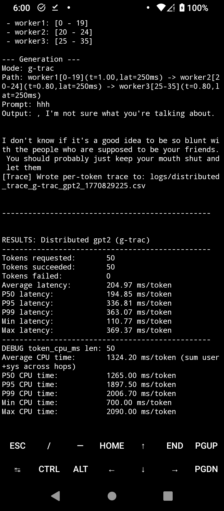

# G-TRAC: Trust-Aware Routing for Distributed Generative AI

**G-TRAC** (Generative Trust-Aware Routing and Adaptive Chaining) is a coordination framework for distributed Large Language Model (LLM) inference over decentralized and unreliable edge networks. It transforms inference routing from a best-effort transport problem into a **Risk-Bounded Shortest Path** control problem, ensuring reliable token generation even on heterogeneous devices.

## Installation

### Prerequisites
- Python 3.8+
- PyTorch (CPU or CUDA enabled)
- Hugging Face Transformers

### Steps

1. Clone the repository:
   ```bash
   git clone [https://github.com/anonymous-123qh/g-trac.git](https://github.com/anonymous-123qh/g-trac.git)
   cd g-trac

2. Install packages:
   ```bash
   pip install -r requirements.txt
    ```

> #### 💡 **Dependency Scope**
> The `torch` and `transformers` dependencies are required **only for `worker` nodes/peers**.  
> The `anchor` and `client` nodes can run without installing these libraries, enabling deployment on resource-constrained devices.

## Usage
### Environment Variables

Set the following environment variables before starting any component:

```bash
export TARP_ENGINE=real
export TARP_MODEL=gpt2-large # Options: gpt2, gpt2-medium, gpt2-large, gpt2-xl
# Optional: To use GPU
export TARP_DEVICE=cuda
```

1. Start the Anchor
   
**Usage**
```bash
python run.py anchor <port>
```
**Example**
```bash
python run.py anchor 5000
```

2. Start worker
   
**Usage**
```bash
python run.py worker <IP> <PORT> <CPU> <FAIL_RATE> <TRUST> <ID> <ANCHOR_IP> <ANCHOR_PORT> <L_START> <L_END>
```
- `CPU`: CPU burn level (e.g., `1`)
- `FAIL_RATE`: Failure rate in range `[0, 1]`
- `TRUST`: Initial trust score in range `[0, 1]`
  
**Example**  
Starting a worker on port `6001` handling layers `0–35` (monolithic mode for testing):

```bash
python run.py worker 127.0.0.1 6001 0 0 1 worker1 127.0.0.1 5000 0 35
```
> #### 💡 **Note:** Replace `127.0.0.1` with the worker’s real IP address (e.g., a Tailscale IP) when running across multiple machines.

   
4. Start client

**Usage**
```bash
python run.py client <ANCHOR_IP> <ANCHOR_PORT> [MODE]
```
MODE (optional): Routing mode to use. Supported values:

- `sp` -- Shortest Path (Latency only)

- `mr` -- Max Reliability

- `larac` -- Lagrangian relaxation

- `naive` -- Baseline random routing

- `g-trac` -- Trust-aware G-TRAC routing (Default)


**Example**   
```bash
python run.py client 127.0.0.1 5000
```
After starrting client, the terminal presents the following options:
- [r] -- Run a prompt
- [m] -- Choose routing mode (routing approaches)
- [s] -- Reset the system to initial state 
- [w] -- Sweep mode (perform all routing approaches under identical experimental configurations; the system state is automatically reset before each run to prevent bias from residual state)
- [q] -- exit

## Logs

Each run generates log files in the `logs/` directory:

- `distributed_trace_<algo>_<model>_<timestamp>.csv`  
 

  #### Formats

| Column | Description |
|--------|-------------|
| `token_idx` | Token index in generation sequence |
| `trace_id` | Unique generation trace identifier |
| `e2e_latency_ms` | End-to-end latency (ms) |
| `sum_hop_cpu_ms` | Total CPU time across hops |
| `sum_hop_wall_ms` | Total wall-clock time across hops |
| `num_hops` | Number of routing hops |
| `max_hop_rss_mb` | Maximum RSS memory per hop (MB) |
| `client_rss_mb` | Client memory usage (MB) |


- `trust_<timestamp>.csv`  
  
   #### Formats

| Column | Description |
|--------|-------------|
| `run_id` | Unique identifier for the experiment run |
| `ts_unix` | Unix timestamp of the measurement |
| `mode` | Routing mode used (`sp`, `mr`, `larac`, `naive`, `g-trac`) |
| `request_id` | Associated request identifier |
| `node_id` | Worker/node identifier |
| `trust` | Current trust score of the node (range `[0, 1]`) |
| `lat_ewma_ms` | Exponentially weighted moving average latency (ms) |
| `alive` | Whether the node is currently alive (boolean) |
| `layer_start` | Starting model layer hosted by the node |
| `layer_end` | Ending model layer hosted by the node |
| `in_chain` | Whether the node was selected in the routing chain (boolean) |
| `failed_id` | Identifier of failed node (if failure occurred) |
   

- `requests_<timestamp>.csv`  


  #### Formats

| Column | Description |
|--------|-------------|
| `run_id` | Unique identifier for the experiment run |
| `ts_unix` | Unix timestamp of the request |
| `mode` | Routing mode used (`sp`, `mr`, `larac`, `naive`, `g-trac`) |
| `engine` | Backend execution engine (e.g., `real`) |
| `model` | LLM model name (e.g., `gpt2-large`) |
| `request_id` | Unique request identifier |
| `prompt_len_tokens` | Number of input prompt tokens |
| `target_new_tokens` | Target number of tokens to generate |
| `generated_new_tokens` | Actual number of tokens generated |
| `completed` | Whether generation completed normally (boolean) |
| `request_success` | Whether the request succeeded (boolean) |
| `request_e2e_ms` | End-to-end request latency (ms) |
| `selection_overhead_ms` | Routing selection overhead (ms) |
| `repair_used` | Whether repair mechanism was triggered (boolean) |
| `repair_attempted` | Whether a repair attempt was made (boolean) |
| `repair_succeeded` | Whether repair succeeded (boolean) |
| `failed_id` | ID of failed worker (if any) |
| `failed_error` | Error message associated with failure |
| `failed_stage` | Stage where failure occurred |
| `chain_ids` | Sequence of worker IDs used in routing |
| `chain_layers` | Layer partitions traversed |
| `client_rss_mb` | Client memory usage (MB) |
| `trust_tau` | Trust decay or smoothing parameter |
| `trust_min_in_chain` | Minimum trust value among workers in chain |
| `trust_mean_in_chain` | Mean trust value across chain |
## Visualization
### Client terminal
#### 🖥️ Client Terminal (Desktop)
<p align="center">
  
</p>

#### 📱 Client Terminal (Termux on Phone)
<p align="center">
  
</p>

### 🌐 Real-Time Dashboard
The G-TRAC Anchor provides a web-based dashboard to monitor network health, trust updates, and routing decisions in real-time. Once the Anchor is running, access the dashboard at: 
**[http://<ANCHOR_IP>:<ANCHOR_PORT>](http://<ANCHOR_IP>:<ANCHOR_PORT>)**

<p align="center">
  
</p>
